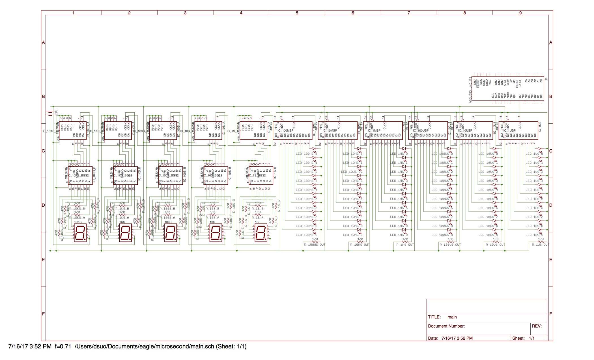

# microsecond
Design files for an **observable** microsecond LED / 7-segment counter. In other words, with a global shutter, you can observe when your shutter opened and closed at microsecond resolution. You can see a toy simulation [here](https://www.tinkercad.com/things/a7C6HA2fbm5-microsecond-clock/editel) (the simulator dies with a more complex circuit).

## Possible issues
  - Not enough voltage
  - Microsecond resolution of various components

## Resources
  - http://electronics.howstuffworks.com/gadgets/clocks-watches/digital-clock7.htm
  - http://www.electronics-tutorials.ws/counter/bcd-counter-circuit.html
